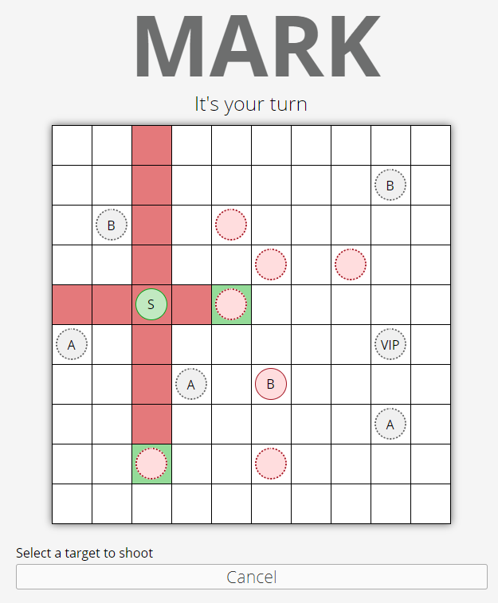

MARK
====

### A 2D multiplayer turn based strategy game written in Javascript

Quick start
----------
 - Make sure Node and npm are installed
 - Run `npm install` and `npm start`
 - Navigate to localhost:3000 in two browser windows

Rules
-----
The objective of the game is to remove your opponents VIP token while protecting yours. Initially the type of each token is hidden to the opponent, however each can be revealed to perform a specific action.

### Current tokens:
 - A / Assassin - Once activated can move to and capture any enemy token two tiles away from it.
 - B / Bomber - When activated the bomber capture itself and **any** other tokens within a small radius around it. Its activation will be triggered on death, even if hidden. Hence, one bomber going off can set of a chain reaction.
 - S / Shooter - Once activated can capture an enemy token it has an onobstructed horizontal or vertical line to.
 - VIP - The VIPs primary active ability it surrender, which immediately captures itself forfiets the game. It however has a secondary ability where is can swap positions with other tiles to allow quick movement of different tokens across the board when needed.
 